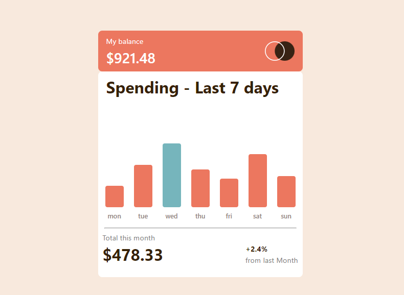
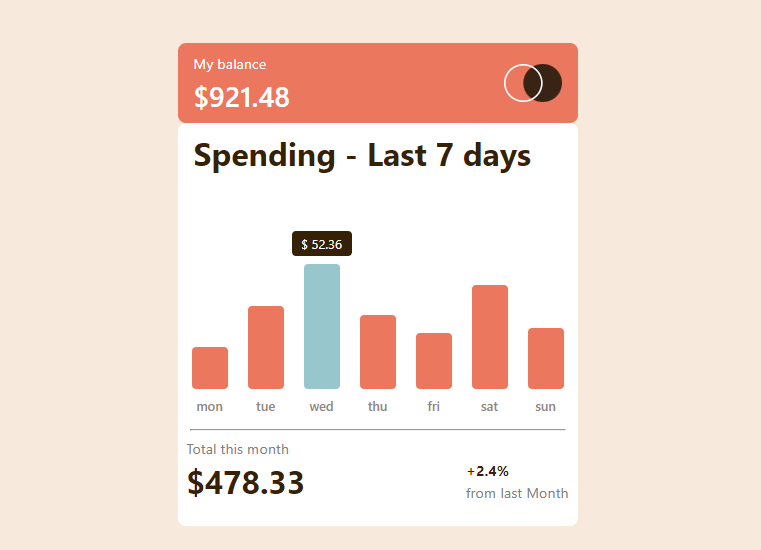

# Expenses chart component solution

This a challenge from  [ Frontend Mentor](https://www.frontendmentor.io/challenges/expenses-chart-component-e7yJBUdjwt), I accept this challenge  to increase my coding skill and exeperience. 

## Table of contents

- [Overview](#overview)
  - [Screenshot](#screenshot)
  - [Links](#links)
- [My process](#my-process)
  - [Built with](#built-with)
  - [What I learned](#what-i-learned)
  - [Continued development](#continued-development)
  - [Useful resources](#useful-resources)
- [Author](#author)
- [Acknowledgments](#acknowledgments)


## Overview

### Screenshot
- **screen short from desktop view**
  - 
- **Screen short of Active State chart**
  - 


### Links

- Solution URL: [solution repository](https://github.com/blackcat-web/expenses-chart)
- Live Site URL: [Live site](https://blackcat-web.github.io/expenses-chart/)

## My process

### Built with

- Semantic HTML5 markup
- CSS custom properties
- Flexbox
- CSS Flex box
- Mobile-first workflow


### What I learned

I have use chart bars with the help of Json data and all the bars are added by Javascript to the index.html file

To see how you can add code snippets, see below:

```html
<div class="bars" id="barArea"></div>
```
```css
.bars{
  width: 100%;
  display: flex;
  justify-content: space-evenly;
  align-items: center;
  gap: 5px;
}
```
```js
//I have added the chart bar with the help of json data and Javascript
fetch("data.json")
    .then(response => response.json())
    .then(data =>{
       //for more code visiti my code section main.js
    })
```

### Continued development

Proper responsive site and mobile first priority is the goal of my web development journey. I strongly believe that in future I have more better knowledge in [react.js](https://legacy.reactjs.org), [next.js](https://nextjs.org) and I hoe I will not do coding from scratch. I will also use famouse frameworks like [angular](https://angular.io/), [Django](https://www.djangoproject.com), [react.js](https://legacy.reactjs.org) and etc . . . .


### Useful resources

- [W3schools](https://www.w3schools.com) - This site help me a lots while I am go deeper into web development and every time I stuck in some kind of layout problem I visit to [w3schools](https://www.w3schools.com/) and almost I get my solution.
- [Github](https://www.github.com) - Github is really a amazing platform where I use to push my repositories and it is be like **Mentos zinddagi** while using github.
- [CodePen](https://www.codepen.io) - CodePen is really cool place where I use to store my nonsense codes (._.) and It is really amazing site for me.

## Author

- Frontend Mentor - [@blackcat-web](https://www.frontendmentor.io/profile/blackcat-web)
- CodePen - [@black-ninja](https://codepen.io/Black-ninja)
- Github - [@blackcat-web](https://www.github.com/blackcat-web/)


## Acknowledgments

I would Like to thank Myself and my anger because all my best works are the result of my angriness also I would like to Thank my **Lapy, Vs Code, Live Server** and at the last but not the least I would like to thanks my **Smart idiot box** my Phone.


